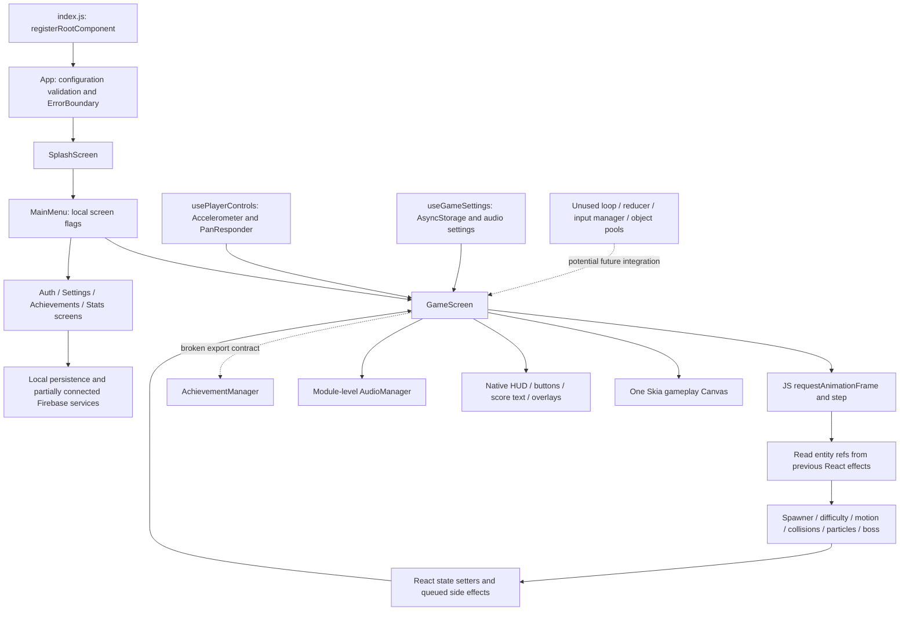

# GALAGEAUX — Codebase, Game Engine, Motion & Visual Audit

Audit date: 2026-09-28. Repository revision: `8627fe3b1272b2893f61d146d8ca9d100963309c`.

Scope: audit only. This report is the sole deliverable created. No application, dependency, asset, native, or test files were changed; no packages were installed; no prebuild, build, deployment, or commit was performed. Existing working-tree changes were preserved: deleted `yarn.lock` and untracked `output.txt`.

Integrity verification: SHA-256 file-manifest comparison for all 198 existing tracked files was unchanged before/after report generation; final working-tree status added only this report to the preexisting changes.

Evidence terminology used throughout:

- **Confirmed:** directly established by source/call-site inspection or a stated in-memory diagnostic. This does not imply reproduction on an iPhone.
- **Likely:** a credible performance or perceptual consequence whose magnitude requires profiling or playtesting.
- **Theoretical:** an optional optimization or design experiment without evidence that it is currently necessary.
- **Unknown:** requires the actual native build, device, production configuration, or player testing.

The reported successful Xcode build, physical-iPhone run, operational Firebase, Expo install check, and 18/18 Expo Doctor result are accepted as the user's verified baseline. This Windows audit independently reran Jest successfully: **12/12 suites, 243/243 tests, 0 snapshots**. It did not repeat native or network validation. Source behavior described below can coexist with a successful build and a playable application.

## 1. Executive Summary

Galageaux has a useful foundation for a polished arcade shooter: one Skia gameplay canvas, procedural ship graphics, layered stars, multiple weapons and boss patterns, audio cues, bounded entity arrays, and many independently testable helpers. Its installed stack is capable of substantially better movement and presentation without a package upgrade.

The principal obstacle is integration correctness. The running game is a large React component with its own animation loop, not the reusable loop, state, reducer, input-manager, and object-pool architecture suggested by some repository documentation. Several substantial features exist as unused helpers. Consequently, passing helper tests do not establish that the live gameplay pipeline is correct. Sources: `src/scenes/GameScreen.js:68,296,339`; `src/hooks/useGameLoop.js:27`; `src/hooks/useGameState.js:61`; `src/engine/objectPool.js`.

The highest-priority confirmed findings are:

1. **Frame callbacks retain stale gameplay state, and later frame writes overwrite earlier events.** Level/bonus/control settings are not all refreshed in the running loop; automatic-fire bullets, player-hit effects/clears, and slow-powerup changes can be overwritten by the final frame commit. Sources: `GameScreen.js:296–307,363,410,697–715,814–835,943–990`.
2. **Enemy behavior differs materially from its configuration.** Timed spawns are inserted twice; escaped enemies are retained; normal kills calculate `NaN` points; configured enemy HP is ignored by collision resolution; configured size/speed/type restrictions are not honored consistently. Sources: `GameScreen.js:461–536,619–620,711`; `src/engine/collisionHandlers.js:35–90`; `src/engine/spawner.js:36–84`; `src/config/enemies.json`.
3. **The touch-control switch is ineffective in the current hook.** The stored responder captures the initial `tiltEnabled=true`, so disabling tilt later does not enable its touch acquisition callbacks. Sources: `src/hooks/usePlayerControls.js:86–99`; `GameScreen.js:104,284`.
4. **Boss timing, aiming, and phase selection have independently verifiable inconsistencies.** Cooldown is decremented twice; aimed fire uses incompatible angle conventions; spread fire goes upward; some configured first phases are unreachable. Sources: `src/engine/boss.js:55–89`; `src/engine/boss-patterns.js:66–143`; `GameScreen.js:552–561`.
5. **Higher refresh rates change the experience.** Tilt filtering, spark drag, and particle shrink are applied per frame instead of per elapsed time. Real-module numerical checks reproduce different trajectories and sizes at 30/60/120 updates per second. Sources: `usePlayerControls.js:110–120`; `src/engine/particles.js:206–245`.
6. **Progress and feedback integrations are incomplete.** Gameplay calls a nonexistent achievement export, omits the toast's visibility prop, uses an invalid post-boss music key, and retains incomplete retry/timer state. Sources: `GameScreen.js:247–269,675–683,993–1029,1176–1178`; `src/engine/achievements.js:250`; `src/engine/audio.js:93–98,344–369`.

These findings should be addressed through small, tested changes before a major rendering migration. First establish dependable input, scoring, lifecycle, entity ownership, and time behavior. Then improve silhouettes, hit feedback, thrusters, readable powerups, and boss anticipation. Moving decorative animation away from React's render cycle is a strong next step; moving the entire simulation into worklets is a later architectural decision.

No measured claim of 60 FPS, 120 FPS, GPU saturation, excessive battery use, or a growing native-memory leak is made in this report. The source reveals avoidable work and correctness problems; device measurements must establish their performance cost.

## 2. Current Architecture

### Verified dependency baseline

Versions were read from both `package-lock.json` and the installed packages; these entries agree. Manifest ranges are not treated as installed versions.

| Package | Installed / locked version | Relevant role |
| --- | --- | --- |
| Expo | 54.0.37 | Application runtime/tooling |
| React | 19.1.0 | Component and state lifecycle |
| React Native | 0.81.5 | Native UI, input, animation scheduling |
| `@shopify/react-native-skia` | 2.2.12 | Gameplay and selected UI graphics |
| `react-native-reanimated` | 4.1.7 | Installed; no application-authored worklet animation |
| `react-native-worklets` | 0.5.1 | Installed worklet runtime |
| `expo-av` | 16.0.8 | Sound effects and music |
| `expo-linear-gradient` | 15.0.8 | Native UI gradients |
| `expo-sensors` | 15.0.8 | Accelerometer input |
| `expo-secure-store` | 15.0.8 | Dormant/customer-auth persistence path |
| Firebase | 12.19.0 | Auth, Firestore, Storage, Functions services |
| AsyncStorage | 2.2.0 | Local preferences/progress |
| Jest / jest-expo | 29.7.0 / 54.0.18 | Unit-test execution |
| React test renderer / RNTL | 19.1.0 / 12.9.0 | Installed test support |

### Runtime map



### Repository/system inventory

| Area | Implementation and current reachability |
| --- | --- |
| Entry and startup | `index.js:1`; `App.js:10–25,69–94`: root registration, JSON validation, loading/config error screen, splash, menu, error fallback. |
| Screens/navigation | `src/scenes/MainMenu.js:12–75` switches screens using booleans; no navigation library. Screens: Splash, MainMenu, Game, Auth, Settings, Achievements, Stats; GameOver is a gameplay overlay. |
| Gameplay orchestration | `src/scenes/GameScreen.js` owns simulation, input integration, fire, stage/level progression, reward callbacks, and rendering. |
| Components | `src/components/canvas/` holds drawing components; HUD, FireButton, ScorePopup, BossHealthBar, HitFlash, Level/Bonus/Stage banners, Pause/Tutorial/Error/GameOver overlays, AchievementToast, and AudioStatusBadge provide presentation. `LiquidGlass*` supplies separate UI canvases/gradients. |
| State | Gameplay uses individual `useState` calls and effect-synchronized refs. `useGameState`, `gameReducer`, and their tests are separate, unused alternatives. Auth/CustomerAuth/Language contexts exist but are not mounted by `App`. |
| Game loop | Local JS `requestAnimationFrame`, `Date.now()`, variable `dt` in `GameScreen.js:296`. No active fixed-step accumulator or Reanimated simulation. |
| Rendering / Skia | Declarative JSX with numeric/string props. One gameplay canvas; additional canvases in menu, Stats, and glass UI. Splash uses native image/animated elements. Native views/text overlay gameplay. |
| Reanimated | Dependency and Babel plugin installed. No application import of shared values, worklets, or `useFrameCallback`; native-driven React Native `Animated` is used for some UI. Skia itself can use Reanimated internally. |
| Gesture/input/sensors | `usePlayerControls.js`: Accelerometer subscription and PanResponder. `FireButton.js`: press-to-fire; pause UI toggles auto-fire. `engine/input.js` keyboard/gamepad/touch abstraction is unused. |
| Collision | Live `collisionHandlers.js` imports inclusive AABB overlap from `collision.js`; touching edges count as collision. Point/distance/circle helpers are separate; no spatial grid is implemented. |
| Entities/pooling | Plain JS objects in arrays. `entities/types.js` supplies dimensions, not an ECS. `objectPool.js` is implemented/tested but not used by gameplay. |
| Projectiles | Player fire built in `GameScreen.fireWeapon`; ordinary enemy bullets in `makeEnemyBullet`; boss velocities in `boss-patterns.generateBossBullets`. |
| Enemy/formation/path | `spawner.js`, `formations.getFormationOffsets`, `paths.diveOffset`; movement is implemented inline in `GameScreen.step`. Full formation controller and swoop starters are unused. |
| Boss | `boss.js`, `boss-patterns.js`, `config/boss.json`, `canvas/BossShip.js`, `BossHealthBar.js`. |
| Particles/shake | `particles.js`, `screenshake.js`, `canvas/Effects.js`; offsets are manually added to drawing coordinates. |
| Powerups | `powerups.js`, collision callback to `GameScreen.applyPowerup`, native timeouts for expiration. |
| Difficulty/progression | `difficulty.js`, `config/waves.json`, `STAGES` in `constants/game.js`; levels 1–10, bonus rounds, three active stages. |
| Backgrounds | `useStarField.js`, `canvas/StarField.js`, `canvas/Background.js`; menu/splash have their own star visuals. |
| Audio | `engine/audio.js`: module singleton, prioritized/lazy sound loading, one sound object per cue, one music object. |
| Persistence | `useGameSettings`, `SettingsScreen`, `achievements`, `StatsScreen`, auth services use several local key/schema families. No live simulation checkpoint/resume save. |
| Firebase | `constants/firebase.js` centrally initializes Firebase; `services/firebase.js` consumes its instances for Auth/Leaderboard/CloudSave, as do older contexts. Active game frames make no Firebase calls. Backend rules and deployed configuration are outside this checkout. |
| Analytics/crashes | `services/analytics.js`, `services/crashReporting.js`, `services/index.js` contain infrastructure; startup does not call the service initializer. `ErrorBoundary` logs and presents recovery UI. |
| Tests | Twelve files under `src/__tests__/engine` and `src/__tests__/hooks`; details in section 16. No screen integration or rendered-game visual tests. |
| Assets | 48 PNGs and 18 MP3s, mostly branding icons and audio. No gameplay sprite atlas, ship texture, nebula texture, or custom font asset. Section 13 details dimensions/usage. |
| Native/config | `app.config.js`, `babel.config.js`, `eas.json`; `ios/` and `android/` are ignored and absent here. No actual Info.plist, Podfile, Podfile.lock, or Xcode build settings to audit. |
| Other code | `ships.js` and `challenges.js` define customization/challenge systems without active gameplay callers. `src/i18n` is used for Stats formatting but is not a broadly integrated localization layer. `sample/LoginScreen.js` and older customer/language context code are not active app routes. `galageauxweb/` is empty. |
| Documentation | Existing architecture/enhancement/profiling documents describe intentions and helpers as well as implemented behavior. They are historical context, not proof of integration. |

Native settings visible here: portrait orientation, `newArchEnabled: true`, iPhone-only support (`supportsTablet: false`), app icons, secure-store plugin, and EAS profiles. Hermes is Expo's installed config-plugin default, but the actual built binary's JS engine/settings were not inspected. `CADisableMinimumFrameDurationOnPhone` is not specified in the app config; its absence there does not prove it is absent from the working iOS binary. Sources: `app.config.js:1–48`; `node_modules/@expo/config-plugins/build/ios/BuildProperties.js:48`.

## 3. Game Loop Analysis

### Actual frame sequence and state ownership

`GameScreen` schedules a recursive `requestAnimationFrame` callback, computes `(Date.now() - lastTimeRef.current) / 1000`, and calls `step(dt)` while not paused/game-over and while the captured player is alive. It reschedules callbacks even when gameplay is paused. There is no active interval driving physics, no Skia callback driving gameplay, and no active use of the reusable `useGameLoop` hook. Source: `GameScreen.js:296–307`.

`step` checks terminal lives, updates shake, snapshots entity refs, ages UI effects, updates stars/input/fire cooldown, advances entities, spawns enemies/boss, resolves collisions, commits entity arrays, then processes bonus time and level progression. Sources: `GameScreen.js:339–780`.

| Storage | Data | Consequence |
| --- | --- | --- |
| React state | Player, bullets, enemies, boss, particles, explosions, powerups, score text, stars, score/lives, flags/settings, level/stage, session stats | React participates in each active simulation frame. |
| Refs | Mirrors of entity/player state, fire/spawn timers, total spawn count, shake state/offset, combo count | Some mutable bookkeeping; entity refs are updated after React commits through effects. |
| Native/UI animation | React Native `Animated` for selected banners, splash, loss/achievement presentation | These animations can progress separately; they do not own gameplay movement. |
| Worklet/native simulation | None authored in the application | Skia's native drawing does not move the JS game logic off the JS thread. |

The frame calls at least thirteen regularly exercised setters across effects/background/array commits, plus conditional setters. Many produce new arrays even when empty. This is **not thirteen React renders**: React can batch setters. The confirmed architecture requests new render work every active frame; the exact commit count, duration, and scheduling relationship require profiling. No `React.memo` boundary isolates the live canvas/HUD tree from `GameScreen` updates. Sources: `GameScreen.js:375–424,709–719`; `useStarField.js:65–76`; canvas component definitions.

### Confirmed timing and ownership defects

- **Stale callback:** the scheduling effect depends only on `isPaused`, `gameOver`, `player.alive`, and `bossSpawned`. Its captured `step` also uses level, stage/difficulty values, bonus state, tutorial state, settings, `updateTilt`, and handlers that read `player`. These are not all read through current refs. A render updating those values does not refresh the existing callback. Sources: `GameScreen.js:143–163,284–307,401–411,508–542,695,725–778`.
- **Concrete progression consequence:** a loop captured at level 1 / no bonus can set level 2 and start a ten-second bonus display, then continue executing the no-bonus branch without decrementing its timer. Pausing/resuming or a boss-spawn transition can refresh the closure and change the behavior. Conversely, a callback captured during a bonus can retain bonus rules after the UI flag clears. This is a source-established branch problem; exact player-facing sequences belong in integration/device tests.
- **Split state authority:** refs track React effect completion rather than the end of each simulation step. Delayed commits can leave the next simulation using an earlier snapshot. This is an architectural risk, not a measured count of lost frames.
- **Same-frame overwrite:** auto-fire appends bullets after `currentBullets` is captured, then `setBullets(survivingBullets)` replaces that queue. Damage handlers similarly append effects/clear entities before frame replacements, and slow powerup modifies enemies before replacement. Sources: `GameScreen.js:363,410–411,697–715,834,909,972–984`.
- **No long-frame protection:** live `dt` is neither clamped nor substepped. There is no `AppState` handling. A callback after OS suspension or a long JS stall can jump positions and timers and miss endpoint-only collisions. The unused hook's 100 ms clamp and fixed-step helper do not protect the active game. Sources: `GameScreen.js:296–307`; `useGameLoop.js:101–103,165–173`.
- **Mixed clocks:** movement/lifetimes use `dt`; weapon/shield/slow/stage transitions use `setTimeout`; boss oscillation, spiral heading, ship flames, and star twinkle read wall-clock time. Pause freezes some systems but not expiry clocks; resume can change animation phase. Sources: `GameScreen.js:675,814–835,1068–1073`; `boss.js:65`; `boss-patterns.js:124`; `useStarField.js:74`.

### Frame independence and frame-rate prospects

Linear projectile/enemy/star displacement generally multiplies velocity by elapsed seconds. That is a good base, but does not make the whole game frame-rate independent. Particle shrink/drag and tilt filtering are exceptions; wall-clock animation and coarse cooldown reset introduce additional differences. No render interpolation is active.

At 60 Hz, the complete frame budget is approximately 16.67 ms; at 120 Hz it is 8.33 ms. The present architecture could run smoothly at light load on a capable iPhone, but this audit cannot establish sustained performance. At higher refresh, it asks JS and React to do more work while changing tilt/effect behavior. ProMotion readiness therefore requires time normalization, profiling, and verification of the actual native refresh configuration, not just enabling a flag. React Native's distinction between JS and UI frame work is documented in its [0.81 performance guide](https://reactnative.dev/docs/0.81/performance).

## 4. Rendering Architecture

Gameplay renders in one `Canvas`, in this order: background, stars, player, muzzle flashes, player/enemy bullets, enemies, boss/health bar, explosions, particles, powerups. Native HitFlash, banners, HUD, FireButton, ScorePopup and modal-like overlays sit above it. Source: `GameScreen.js:1079–1183`.

| Primitive/capability | Actual use |
| --- | --- |
| `Canvas`, `Group` | Gameplay scene composition; separate canvases in menu/Stats/glass UI. |
| `Rect`, `Circle` | Most enemies, boss, bullets, powerups, stars, fake glows, nebula disks, HUD boss bar. |
| `Path` | Player body, wings, detail lines, highlights; coordinate strings rebuilt in render. |
| `LinearGradient`, `vec` | Player body/exhaust and glass UI; no runtime shader program. |
| Opacity/color animation | Numeric alpha in color strings driven by JS state/time; native `Animated` on selected UI. |
| Transforms | Most gameplay position/shake uses coordinate arithmetic. No bank/orientation transform for player/enemies. Native UI uses scale/translation/opacity. |
| Blur | Glass UI declares standalone Blur nodes; their intended effect is not established (see section 18). Active gameplay effects do not use blur or blur masks. |
| Images/sprites | No Skia image-based gameplay assets or sprite-sheet animation. Native image used for splash branding. |
| Runtime shaders, masks, radial gradients, additive blend, bloom, distortion | Not used by the gameplay renderer. A linear gradient is technically a shader, but no custom SkSL/runtime effect is authored. |

Sources: `src/components/canvas/*.js`; `src/components/BossHealthBar.js`; `LiquidGlassBackground.js`, `LiquidGlassButton.js`, `LiquidGlassCard.js`, `LiquidGlassHeader.js`, `LiquidGlassModal.js`, `LiquidGlassTabBar.js`; `src/scenes/MainMenu.js:79`; `SplashScreen.js`.

Skia is a sensible foundation: hundreds of world objects are not individual native Views, and graphics are resolution-independent shapes. The unused opportunity is the update path. Shapes receive freshly computed props and JSX through React rather than using stable geometry and shared/derived values for independent animation. Installed Skia's `src/sksg/Container.native.ts` can record/react to Reanimated values internally; absence of application worklets does **not** mean the library itself never uses Reanimated.

Confirmed per-frame work includes player path-string construction, gradient point/color arrays, new JSX for mapped entities, particle/color objects, and 100 cloned star objects. These are likely CPU/allocation contributors, not proven GPU bottlenecks. Cache local-space ship geometry and transform a group only after coordinate/hitbox tests are in place. Use stable entity identity before caching or pooling; many mapped items currently use index-based keys. Sources: `PlayerShip.js:34–65,79–124`; `Effects.js:46–148`; `Bullets.js`; `useStarField.js:65–76`.

Native Views remain appropriate for accessible menus, buttons, settings, and readable HUD text. The strongest candidates for a shared canvas/animation path are floating world score text and full-screen impact color, whose per-frame native updates track the game. `ScorePopup` currently changes positioned native text; its layout/commit cost requires measurement. Porting every UI component to Skia would add complexity without a demonstrated benefit. Sources: `ScorePopup.js:16`; `HitFlash.js:13`; `GameHUD.js:28`.

## 5. Player Motion Analysis

The player is a 40 × 22 logical-unit ship, starts centered at `y = 0.8 * screenHeight`, and moves only horizontally. The default input is tilt. Sensor updates are requested every 16 ms, with accelerometer X copied into a ref; this requested interval is not a measured delivery rate. Every game step filters the sensor value with `0.85 * current + 0.15 * target`, then computes horizontal displacement as `-filteredTilt * width * dt * 2.1 * (sensitivity / 5)`, with a 1.25 bonus multiplier. Clamp is `[0, width - playerWidth]`; displacements at or below 0.05 are discarded. Sources: `entities/types.js:1–2`; `GameScreen.js:70–80,104`; `usePlayerControls.js:63–123`.

This is smoothing of the input signal followed by direct velocity integration. It is not acceleration-based ship physics; there is no persistent ship velocity, deceleration curve, neutral calibration, true sensor dead zone, bank, directional thrust, motion trail, or predictive positioning. Expected feel is filtered tilt steering with some lag near direction changes; actual comfort/latency has not been playtested.

The fixed filter has a time constant of about 103 ms at 60 updates/s and 51 ms at 120. After 100 ms of a step input, response is approximately 62.3% versus 85.8%. The per-frame displacement cutoff also corresponds to a higher velocity threshold at higher refresh. These follow directly from the formula; physical sensor noise and total touch-to-photon delay remain unknown.

Touch intends to center the ship on absolute `gesture.moveX`, subtracting half the ship width and clamping. There is no relative drag offset, initial grant positioning, acceleration, or touch smoothing. However, `useRef(PanResponder.create(...))` keeps callbacks from the first render, including the initial enabled tilt flag. Disabling tilt later does not enable those responder-acquisition predicates. Also, the `PanResponder.create` expression is evaluated on subsequent renders even though its result is discarded. Sources: `usePlayerControls.js:79–99`.

The settings range is inconsistent: menu settings use 0.5–3 with default 1.5, while gameplay settings default to 5 and restore an integer clamped to 1–10. For example, saved 1.9 restores as 1 in gameplay. The active loop can additionally retain the earlier sensitivity callback. Sources: `SettingsScreen.js:31,273–274`; `useGameSettings.js:35,51–53`; `GameScreen.js:284–307`.

Existing visual response is an animated three-part exhaust, ship glow, bonus/shield halos, and damage flash. Flame motion is a wall-clock sine, not responsive to steering or acceleration. Some thruster coordinates apply shake twice after center/ship coordinates already include it, producing different displacement from the hull. Sources: `GameScreen.js:1068–1073`; `PlayerShip.js:34–37,159–213`.

Recommended direction: restore dependable input-mode selection and settings first; use an elapsed-time filter and an explicit calibrated neutral/dead-zone policy; evaluate relative horizontal dragging on-device. Preserve quick stopping. Add a small visual bank and direction-sensitive thruster response driven by velocity without rotating the collision box initially. Strong inertia, overshoot, or predictive movement should be optional prototypes: dodging needs precise control more than cinematic motion.

## 6. Enemy Motion Analysis

`spawnWave` selects a five-ship V formation 30% of the time, a five-ship line 30%, and one enemy 40%. Formations use fixed offsets and start above the screen. Each member independently receives a weighted enemy type. The live seven-type distribution is grunt 40%, dive 20%, shooter 15%, scout 10%, kamikaze/tank/elite 5% each. Stage `enemyTypes` arrays do not constrain it. Sources: `spawner.js:36–55,94–137`.

| Behavior | Actual motion / limitation |
| --- | --- |
| Straight | `y += speed * dt`, no horizontal change. |
| Zigzag | `baseX + sin(y / height * 4π) * 40`; two horizontal cycles per screen height. |
| Dive | `baseX + sin(y / height * 2π) * 70` through `diveOffset`; positional wave, not a swooping flight maneuver. |
| Chase | Normalized vector toward the current player center every frame; no turn-rate limit, anticipation, or contact damage invocation. |
| Formation | Initial layout only. V members receive dive; line members zigzag. No shared formation leader/clock thereafter. |
| Other config patterns | `formation_v` or `circle` on a single enemy have no matching live movement branch and fall through to straight movement. Later config also names spiral/pincer/swarm behavior without a live implementation. |
| Swoops / full formations | `updateSwoop` is conditional on `swoopState`, but the live spawner supplies none and `startSwoop` has no active caller. Full `createFormation/updateFormation` are not integrated. |

Sources: `GameScreen.js:461–515`; `paths.js:1`; `spawner.js:69–85,125–133`; `formations.js`; `swoops.js`.

Confirmed data mismatches undermine visual identity and difficulty. `createEnemy` reads `cfg.speedMultiplier` although configuration defines `speed`, and always uses `ENEMY_SIZE=28` rather than `cfg.size`. A base-speed-100 diagnostic produces speed 100 / size 28 for grunt, scout, tank, and kamikaze. Spawn shooting flags also override config: tank is disabled and scout enabled. Configured HP is copied into entities but ignored by normal enemy-hit resolution. Sources: `spawner.js:36–44,69–84`; `config/enemies.json`; `collisionHandlers.js:35–90`.

Timed waves are inserted into both `advancedEnemies` and `spawnBuffer`; the latter is concatenated after collision survival. A newly spawned survivor therefore appears twice. This affects density, overlapping graphics, collision/kill counts, and firing. Escaped enemies are never culled from the live enemy array. Because spawns stop when resident count reaches the difficulty cap, missed enemies can eventually stop waves while sitting off-screen. These arrays are capped, so this is retention/progression failure rather than unlimited memory growth. Sources: `GameScreen.js:515,527–536,711`; `collisionHandlers.js:89`; `entityLimits.js:65–66`.

Boss appearance is driven by **total enemies spawned**, not kills, despite the local comment. In level 1, the stage-1 resident cap is 24 while the boss quota is 40 spawned. Retention and duplicated residents can fill the first threshold before reaching the second. Sources: `GameScreen.js:542,919–920`; `difficulty.js:55`; `config/waves.json:3–5`.

The current design is consequently repetitive: same initial shapes, fixed sine waves, no visible heading changes, and immediately reactive chasing. After correcting spawn/config ownership, short authored Bezier entrances, staggered shared formation timing, and telegraphed curved dives would be perceptible improvements. Keep paths deterministic and collision positions authoritative. Add turn/bank visuals independently before introducing elaborate flocking.

### Difficulty and progression rules

The production difficulty helpers define kill targets of 4, 6, 8 for levels 1–3, then `6 + 3 * level`, with a live level cap of 10. The difficulty multiplier progresses through 0.6, 0.7, 0.8, 0.9, 0.95 and then 1.0. Spawn interval divides the stage base by this multiplier, subtracts 0.03 seconds per additional level, applies a bonus-round factor of 0.6, and floors at 0.5 seconds. Resident capacity combines the stage base times difficulty, two additional enemies per level and three during bonus. Enemy speed grows by 8% of base per additional level, with difficulty and a 1.25 bonus factor; hostile bullet speed grows by 6% per level with difficulty. Sources: `difficulty.js:12–101,152`.

Every live advancement to levels 2–10 starts a ten-second bonus with intended 1.5× kill score, faster spawning/movement, and player invulnerability; bonus kills do not count toward the next level. These intended formulas are not reliably applied while the loop retains stale values. Central constants describing a bonus every five levels for fifteen seconds are not what this live path executes. Sources: `GameScreen.js:725–778,1049–1063`; `difficulty.js:152`; `constants/game.js:169–170`.

## 7. Boss System Analysis

There are three active bosses, one per `STAGES = ['stage1','stage2','stage3']`, with HP 100/150/200. Wave JSON contains stages 4–6, but they are not reachable through current stage progression and have no matching boss definitions. This is dormant content, not a stage-4 crash in the active three-stage campaign. Sources: `constants/game.js:298`; `config/waves.json`; `config/boss.json`; `GameScreen.js:669–687`.

Bosses are 80 × 60, start at `(width/2 - 40, -120)`, and enter toward Y=100 at 40/50/60 units/s. Nominal entrance durations are 5.5/4.4/3.67 seconds. Movement is not eased or clamped at the endpoint. After entry, the boss integrates a horizontal sine velocity with amplitude 20 units/s and period about 3.77 seconds, producing only roughly 12 units of positional oscillation amplitude; wall-clock phase determines the offset. There is no explicit entrance/combat/transition/death state machine, screen-bound clamp, turn animation, or active swoop. Source: `boss.js:29–69`.

Firing is permitted during entrance. `updateBoss` decrements cooldown, then `GameScreen.step` decrements it again and resets it to 1.1. A 60-step/s in-memory sequence reproduces 18 volleys in ten seconds, approximately twice the comment's intended rate. Sources: `boss.js:68`; `GameScreen.js:552–561`.

| Stage | Configured thresholds/patterns | Selector behavior at full HP |
| --- | --- | --- |
| 1 | 70 radial, 40 spread, 0 burst | Radial; transitions at percentage thresholds. |
| 2 | 100 spiral, 60 aimed, 0 burst | Aimed; strict `100 > 100` is false, so spiral is unreachable. |
| 3 | 140 radial, 80 spiral, 40 aimed, 0 burst | Spiral; percentage health never exceeds 140, so radial is unreachable. |

The selector compares percentage HP to thresholds that in later stages appear to have been authored as absolute HP. Intent must be settled before changing balance. `phaseIndex` is initialized but does not drive transitions. Sources: `boss.js:40,79–89`; `boss-patterns.js:47–60`; `config/boss.json`.

The boss art is a glowing rectangle with inset detail; glow color changes at health bands, and a health bar provides basic progress feedback. Ordinary hits add impact particles and an enemy-hit sound. Death produces one large expanding explosion, particle requests of 50 boss plus 30 debris that expand to 135 particles including secondary bursts, shake, a fixed 1000-point award, sound, and stage overlay. There is no wind-up, explicit phase-transition animation, attack tell, staged disintegration, or entry title. Sources: `canvas/BossShip.js:17–29`; `BossHealthBar.js`; `collisionHandlers.js:142–199`; `particles.js:46–114`; `GameScreen.js:644–687`.

Future choreography should first make fire timing, targeting, and phases explicit and tested. Then add a safe entrance interval, a brief charge tell, differentiated phase posture/color, and a short death sequence. The three bosses should differ in silhouette and attack rhythm, not only health and bullet speed.

## 8. Projectile Analysis

Player shots are 4 × 14 rectangles with layered circular glows and fixed-offset trail dots. They spawn at the player's top edge and move straight upward. Nominal speed is 420, with 430/440 variants; cooldowns are 0.22 seconds normally and 0.12 in rapid fire. These differ from unused central constants such as player bullet speed 800 and cooldowns 0.15/0.08. Sources: `entities/types.js:4–5`; `GameScreen.js:851–910`; `constants/game.js:27–29,50`; `canvas/Bullets.js:16`.

Double/triple fire uses fixed parallel horizontal offsets. Spread constructs five initial offsets and slightly different vertical speeds but supplies no horizontal velocity, and the movement code changes only Y. It therefore creates a narrow group of parallel projectiles rather than a diverging fan. Sources: `GameScreen.js:438–440,869–877`.

Automatic-fire bullets are subject to the same-frame replacement described in section 3. Manual `onPress` is wired directly to `fireWeapon(force=false)`, so the event object is truthy as `force`; cooldown still protects firing, but `setCanFire(false)` and the handler's non-force guards are skipped. The button's own disabled prop still gates normal presses. This is a contract/UI-feedback inconsistency, not proof that users can always fire while paused. Sources: `FireButton.js:39`; `GameScreen.js:851–858,1074`.

Ordinary enemies shoot straight down. Boss patterns generate radial 12-shot, spread 7-shot, burst 8-shot, spiral 6-shot, and aimed 1-shot volleys with stage speeds 260/280/300; aimed multiplies speed by 1.2. Sources: `GameScreen.makeEnemyBullet`; `boss-patterns.js:104–143`; `config/boss.json`.

The boss velocity convention is `vx=sin(angle)*speed`, `vy=cos(angle)*speed`. The aimed/burst calculations use `atan2(dy,dx)+π`, which does not match that convention. In a diagnostic with the player directly below the boss, aimed stage-1 fire travels left at `vx=-312`, `vy≈0`. All seven spread bullets have negative Y velocity, with stage-1 values approximately -214.6 to -260: they move upward. Radial symmetry remains a radial pattern; spiral rotates using wall-clock time rather than combat time. Sources: `boss-patterns.js:66–76,118–143`.

Player shots are removed above the screen. Enemy shots are culled below and horizontally, but have no upper-bound cull; upward bullets can continue consuming capped slots until later eviction. Neither bullet type has stable IDs in the live constructors. Caps keep the newest 100 player and 150 enemy bullets, which can visibly delete older active threats/shots when exceeded. Sources: `GameScreen.js:438–450,709–710`; `entityLimits.js:15–20`; `constants/game.js:149–150`.

Projectile trails currently consist of attached dots, not historical trajectories. First correct directional math and spawn ownership; then add narrow luminous cores, short bounded trails aligned to velocity, and a small contact flash at the actual hit location. Preserve a clear distinction between dangerous projectiles, background stars, and friendly fire.

### Powerup and weapon lifecycle

Each ordinary enemy-destruction callback rolls a 10% drop chance, then uniformly chooses spread, double, triple, rapid fire, shield, or slow. Drops are size 20 and fall at 70 logical units/s; they rotate in state but not visually. Weapon effects use ten-second timers, shield four seconds, and slow three seconds. Sources: `GameScreen.js:610–614,791–837`; `powerups.js:59–84`.

Multiple pickups schedule independent expirations, so an earlier callback can cancel a newer effect. Weapon expiry decrements the current level by one and clears weapon type; a triple/spread upgrade to level 3 can expire to level 2 rather than restore the original level 1. Shield/slow timers also continue through pause, while slow's initial enemy update is overwritten by the same frame's commit. This is neither a single coherent timed-effect system nor the weighted five-type/duration scheme in unused central constants. A future design should specify refresh/stack/replace rules and expose the authoritative remaining time to the HUD. Sources: `GameScreen.js:809–835`; `powerups.js:92–110`; `constants/game.js:125–140`.

## 9. Collision Analysis

The live collision model is discrete, inclusive axis-aligned rectangle overlap. It checks moved bullets against moved enemies, moved bullets against the boss, enemy bullets against the player's snapshot, and powerups against that player. It does not sweep between previous and current positions. Touching edges count as collision, as explicitly tested by the existing AABB suite. Sources: `collision.js:30–36`; `src/__tests__/engine/collision.test.js:23–28`; `collisionHandlers.js:17,119,217,259`; `GameScreen.js:572–700`.

`checkEnemyPlayerCollisions` exists for kamikaze contact but is not imported or called by `GameScreen`. Chase enemies can visually intersect the ship without this contact-damage response. Point/distance/circle helpers are also outside the active collision path; no spatial-grid implementation exists. Sources: `collisionHandlers.js:292`; `GameScreen.js:14`; `collision.js`.

The bullet/enemy handler stops at the first unconsumed overlapping bullet per enemy, removes the enemy immediately, produces destruction effects, and increments kills. It never decrements or inspects enemy HP. A diagnostic tank with HP=4 dies to one shot. The scoring formula reads `cfg.score`, whereas every configured enemy defines `points`; it produces `NaN` and a `+NaN` popup. `GameScreen` converts the aggregate `NaN` to zero using `scoreGain || 0`, so normal enemies add no numeric score through this path. Boss kills still award 1000. Sources: `collisionHandlers.js:35–90,194`; `GameScreen.js:619–620,656`; `config/enemies.json`.

Player-hit handling consumes only the first overlapping enemy bullet per frame. There is no active post-hit invulnerability timer despite an invincibility constant in the repository. Other overlapping bullets survive to later frames, and attempted bullet/enemy clears can be overwritten at frame end. Shield checks read a captured player object instead of the current snapshot. Together, these make damage feedback and damage rules unreliable. Sources: `collisionHandlers.js:217–242`; `GameScreen.js:697,709–713,943–989`; `constants/game.js:34`.

At enforced caps, enemy-vs-player-bullet work is up to 60 × 100 = 6000 candidate comparisons per step before early exits, with temporary rectangles created in the inner loop. It is O(enemies × bullets), not an all-entity physics simulation. New entities are processed before final caps, so those are normal-state bounds rather than strict maxima for every transient frame. No profile demonstrates that a spatial grid is needed now. Correct lifecycle and bounding first; consider a broad phase only when collision timing is measured to be material.

Regression priorities: finite score awards, multi-hit enemies, one-consumer bullet ownership, shield/i-frame rules, contact damage intent, fast-crossing collisions, corner/edge behavior, and visual/collision alignment. Higher speeds, smaller silhouettes, banking, or interpolation must not silently alter the game's fairness.

## 10. Particle/Effects Analysis

The engine already contains useful effect vocabulary, but the renderer exposes only part of it. `particles.js` creates default/boss/energy/debris particles, sparks, impacts, trails, explosions, and large-explosion/flash descriptions. The live renderer draws every particle as a circle and ignores its `alpha`, `rotation`, `type`, and `glow`. Trail, large-explosion and screen-flash helpers are not connected to gameplay. Sources: `particles.js`; `canvas/Effects.js:17,94–105`; `canvas/index.js`; live callers in `collisionHandlers.js` and `GameScreen.js`.

### Confirmed effect-timing defects

Particle alpha is derived from remaining life, but radius repeatedly multiplies its current value by `sqrt(alpha)`. Spark velocity is multiplied by 0.98 each frame. Several factories also sample `life` and `maxLife` independently, allowing normalized life above one. A real-module, read-only diagnostic used identical initial spark state—radius 4, X velocity 100, life/maxLife 0.8—and advanced exactly 0.2 seconds:

| Update rate | Remaining life | Radius | X velocity |
| --- | ---: | ---: | ---: |
| 30 Hz | 0.6 | 2.46683 | 88.58424 |
| 60 Hz | 0.6 | 1.63618 | 78.47167 |
| 120 Hz | 0.6 | 0.71949 | 61.57803 |

This establishes visible/trajectory dependence on update rate; it does not measure rendering performance. Use a fixed initial radius and an elapsed-time envelope in a future fix. Sources: `particles.js:62–63,84–85,104–105,206–245`.

`updateExplosion` calculates radius progress from the old life before decrementing life, causing a newly created zero-radius explosion to remain zero-radius on its first update. `updateScreenshake` decrements duration before calculating an unclamped fraction: intensity 10, remaining/max duration 0.1, and dt 0.3 permit a final offset as large as ±20. Sources: `particles.js:307–328`; `screenshake.js:43–61`.

### Effect-by-effect assessment

The performance column describes source-visible work, not measured frame cost.

| Effect | Current implementation | Limitation | Performance characteristics | Improvement potential |
| --- | --- | --- | --- | --- |
| Player hull/glow | Paths, linear gradients, layered circles; `PlayerShip.js:34–155` | Static heading; disconnected brand/player palettes | Path strings and gradient objects regenerated per render | Cache local geometry; coherent material palette; subtle visual banking |
| Engine exhaust | Three gradient rectangles and bright cores; sine-driven length/width | Rectangular, unrelated to steering; double shake offsets | Few shapes, but React-driven and new coordinates each frame | Tapered flame, velocity-driven brightness, short bounded exhaust trail |
| Muzzle flash | 0.1-second effects, five circles per flash; `Bullets.js:71` | Can play even when auto-fire bullet is overwritten | Small short-lived mapped arrays | Sharp initial flash, softer decay, matching actual weapon emitters |
| Player projectile glow/trail | One rectangle plus eight circles per bullet; `Bullets.js:16–39` | Fixed-offset dots rather than path history | Nine drawing nodes per bullet; 900 at cap 100, not necessarily 900 GPU draw calls | Fewer purposeful layers; narrow core; velocity-aligned short streak |
| Enemy/boss projectiles | Orange rectangle + glow circle; `Bullets.js:51` | Same look across directions/patterns | Two primitives per bullet, cap 150 | Clear dangerous core/outline and useful pattern distinctions |
| Ordinary enemy destruction | Expanding colored explosion, main particles/burst and sparks, score/combo text, sound, shake; `collisionHandlers.js:59–85` | HP/scoring bugs impair meaning; all debris appears circular | A requested 16 default particles includes an added burst: 24 particles plus eight sparks, 32 total per kill; capped at commit | Small white hit core, few legible debris fragments, thin shockwave ring |
| Boss hit | Six impact particles per hit, sound and health reduction; `collisionHandlers.js:146–157` | Impacts randomized near center instead of actual contact; no hull flash | Cost increases with simultaneous hit count | Contact-position flash/sparks, brief body highlight, restrained health-bar easing |
| Boss death | Large explosion, boss/debris bursts, shake, sound, +1000; `collisionHandlers.js:168–198` | Immediate opaque overlay obscures aftermath | Requested 50 boss particles expand to 75; 30 debris expand to 60: 135 before final impact sparks, within a 300 global cap | Short staged breakup and delayed overlay; strong few layers rather than more particles |
| Explosion/shockwave | Three filled circles, expanding radius and fading colors; `Effects.js:45–84` | Outer filled disk is not a distinct ring; `frames`/`shockwave` metadata unused | Three primitives each, cap 20, no blur | Thin expanding stroke and radial falloff around a brief white core |
| Particles/sparks/debris | Velocity/gravity/rotation/life updates; circles rendered | Fade/rotation/type computed but unused; frame-dependent drag/shrink | Clone per particle, map/filter allocations, cap 300 | Time-normalized envelopes, small oriented streaks and varied debris shapes |
| Player damage | Red ship/screen flash, HUD pulse, -1 LIFE popup, shake/audio, attempted energy burst; `GameScreen.js:961–984` | Burst/clears overwritten; stale impact location; no reliable recovery interval | Native style and Skia updates on each effect frame | Commit event once; readable damage/invulnerability phase; brief controlled shake |
| Shield | Three translucent circles; HUD indicator; absorption sound/text | No remaining-duration cue; stale collision handler can disagree with visible shield | Few inexpensive shapes | Thin outline, activation/absorption ripple, expiry warning |
| Bonus protection | Three gold circles and countdown/banner | UI state can disagree with captured collision rules | Low shape cost, per-frame countdown state | Explicit entry/exit cue after fixing state machine; preserve bullet contrast |
| Powerup | Falling colored orb; sound and state mutation on collection | Color collisions, no glyph/name/timer; rotation ignored | Two circles each, cap 10 | Distinct glyph/shape, subtle pulse, concise pickup/expiry feedback |
| Screen shake | Independent random X/Y offsets with remaining-time falloff; `screenshake.js` | No clamped expiry; weaker event replaces stronger; inconsistent manual transforms | Coordinates/path strings change across world; no proven bottleneck | One world-group transform, bounded coherent impulse, preference for reduced motion |
| Hit flash | Native full-screen red View; `HitFlash.js:13` | Changes through React every decay step | Native opacity/style commits | Native-driven envelope or one Skia rectangle; choose based on profiling |
| Score/combo text | Native positioned Text, upward motion and fade/scale; `ScorePopup.js:35–71` | Overlapping combo announcements; current normal score is NaN | Up to 30 text items; changing top/font size can cause layout work | Event-driven transform/opacity; consolidate combo announcements; Skia text only if justified |
| Level announcement | Native-driven spring/opacity with timeout; `LevelBanner.js:18–51` | Coordination with immediate bonus banner is unclear | Already a reasonable small UI animation | Refine pacing, repeat-animation reset, and level/bonus sequencing |
| Stage/victory | Static card over 85%-opaque background; `StageCompleteOverlay.js:15–35` | Obscures boss death; no final replay/menu action on the card | Simple overlay, but simulation continues underneath | Delayed reveal, explicit transition/win phase, clear next action |
| Game over | Native-driven fade/spring/slide; `GameOverOverlay.js:9–27` | Immediate simulation stop can freeze final death effects; game-over track unused | Appropriate native UI animation | Let short death effect complete; clear retry/reset and music state |
| Achievement | Native-driven toast exists | Not displayed: missing `visible`; upstream achievement call also broken | Currently no visible toast cost | Repair contract, queue rewards, avoid covering active threats |
| Splash | Native logo spring, letters,24 spark elements, timed progress; `SplashScreen.js:16–90` | Progress is scheduled presentation, not actual complete resource loading | Mainly native animation; progress-width animation uses JS | Honest loading state if needed, brand consistency, lifecycle cancellation |
| Scene-transition helpers | Fade/wipe/flash/stage functions in `ScreenTransitions.js` | Unreferenced by active screens | No current runtime cost | Select only transitions needed by actual game phases |

Additive-looking glow can be achieved first with a white core and restrained colored falloff. Local radial gradients and a few bounded blur masks are plausible next tools. Layered explosions, sparks, debris, and ring shockwaves provide more readable impact than simply increasing particle counts. Full-screen bloom, animated distortion, and per-particle blur should remain experiments with device GPU/thermal budgets. Capability evidence is in section 17.

## 11. Background Analysis

The game already has depth cues. `createStarField` produces 100 stars: about 30% far,40% middle,30% near, with speed bands 15–40,40–80,80–140 units/s and increasing sizes. Stars wrap to Y=-5 at a newly randomized X; near stars add a glow circle and size pulse. This is three-speed scrolling parallax, not camera/player-responsive parallax. Sources: `useStarField.js:31–49,65–76`; `canvas/StarField.js:27–53`.

`Background` draws a dark base rectangle, a solid translucent rectangle over the upper 65%, and two filled circles of radius 220 and 190 with pulsing opacity. Its comment says gradient, but this component contains no gradient. The circles are simple hard-edged disks, not textured nebula clouds. Source: `canvas/Background.js:18–43`.

All 100 stars are cloned every update. Twinkle is computed in the hook and then independently recomputed in the renderer; the stored value is not used by the rendering formula. Flames, twinkle, and nebula pulses use separate wall-clock samples. Stage names do not change the background or its colors. Sources: `useStarField.js:72–75`; `StarField.js:29`; `GameScreen.js:1068–1073,1080–1087`; `config/waves.json`.

The menu uses 60 fixed-position circles whose radii are randomly regenerated when that component renders. Stats has a gradient and 40 circles with similar render-time randomness. These are not continuous high-volume gameplay work when those screens are absent. Sources: `MainMenu.js:79–88`; `StatsScreen.js:175`.

Best initial improvement: soften the nebula with actual gradients, use restrained stage-specific palettes, keep the center/lower playfield quiet, and drive decoration from one visual clock with explicit pause policy. Add subtle lateral parallax only if it improves spatial clarity. A low-resolution nebula texture or shader may help later; full-resolution animated noise is not needed to achieve a substantially better background.

## 12. Audio/Feedback Analysis

`audio.js` registers 14 effect cues and four music tracks. Initialization loads three critical and three important cues, then schedules eight lower-priority cues after 100 ms. Audio mode enables iOS silent-mode playback and does not request staying active in the background. The sounds are real local MP3 files, despite placeholder-related documentation. Sources: `audio.js:70–98,159–281`; `assets/sounds`; `assets/music`.

Each cue owns one `Audio.Sound`, not a multivoice sound pool. Every trigger awaits rewind, volume adjustment, and playback. Repeated cues therefore reuse/restart the same sound; truly independent overlapping instances of that cue are not supplied. Actual onset latency, audible interruption, and native-call contention require device listening/profiling. Sources: `audio.js:159–176,319–334`.

Confirmed lifecycle/integration problems:

- Post-boss transition requests nonexistent `background`; `playMusic` unloads current music before checking the name. Valid key is `gameplay`. Sources: `GameScreen.js:682`; `audio.js:93–98,349–359`.
- MainMenu's music effect runs only on mount, but MainMenu stays mounted while returning GameScreen. GameScreen cleanup pauses music; returning to menu does not restart it. Reentering the same requested track can early-return without resuming. Sources: `MainMenu.js:22–37,71`; `GameScreen.js:230–233`; `audio.js:346`.
- Ordinary pause does not pause music; final loss does not request the available `gameOver` theme. This may be a design choice for pause, but loss/return behavior lacks an explicit audio phase policy. Sources: `GameScreen.js:985–989,1031–1034`; music call-site search.
- Menu settings toggles set state and then save from the old closure, persisting/reapplying the prior values. Sources: `SettingsScreen.js:68–101`.
- `retryAudioInit` discards the old sound map without unloading its handles. `cleanupAudio` exists without an application caller. Keeping 14 sounds for app lifetime can be intentional; overwriting their references on retry is a separate resource-lifecycle risk. Sources: `audio.js:306–310,489–513`.
- Initialization already in progress returns an unsuccessful status rather than sharing its pending promise. Fast navigation can request music before loading finishes. This is a likely startup race, not a measured failure rate. Source: `audio.js:221–229`.
- Music tempo state is cached separately from track loading; a newly loaded track may not receive the cached rate because the level effect does not rerun. Sources: `audio.js:516–535`; `GameScreen.js:241–244`.

AudioStatusBadge unsubscribes its state listener. Some native animation loops and lazy-load/timing operations lack explicit stop/cancellation ownership; verify repeated navigation rather than assuming permanent leaks. Sources: `AudioStatusBadge.js:16–42`; `SplashScreen.js`; `audio.js:270`.

Menu audio initializes before gameplay restores stored audio settings, so cold launch with music disabled should be tested. Gameplay also reads audio settings twice, in its own mount effect and in `useGameSettings`. This is redundant startup work and a consistency risk, not per-frame I/O. Sources: `GameScreen.js:201–234`; `useGameSettings.js:41–75`.

No gameplay haptic/Vibration invocation was found. Brief haptics could eventually reinforce damage or major rewards, but they are optional, require explicit preference/intensity design, and should not become a dependency for core visual improvements.

## 13. Asset Inventory

PNG dimensions were inspected from file headers. Representative images (`icon.png`, configured iOS icon, `splash.png`, `favicon.png`) were visually inspected. Audio metadata was read using the already-installed `ffprobe`; the audit did not listen to the tracks.

### Graphics

| Asset(s) | Format / resolution | Usage and observations |
| --- | --- | --- |
| `assets/icon.png` | PNG 1024×1024;1,220,356 bytes | JS splash logo (`SplashScreen.js:149`), displayed 160×160 inside a clipped 140×140 circular card. Ample source resolution; inspect embedded lettering/crop on-device. |
| `assets/icon - Copy.png` | PNG 1024×1024; same byte count/hash as icon.png | No source reference; exact duplicate. Preserved. |
| `assets/splash.png` | PNG 1242×2436;77,009 bytes | Unreferenced white “Splash Screen” placeholder; not the current animated JS splash. |
| `assets/favicon.png` | PNG 48×48;1,466 bytes | Configured web favicon; visually an Expo-style black/white cube, not Galageaux artwork. |
| `assets/icons/notext_ios_*.png` | Fourteen square PNGs:20,29,40,58,60,76,80,87,120,152,167,180,512,1024 | The 1024 variant is configured globally and for iOS;1,180,451 bytes. Others are exported sizes, without direct JS/config references. |
| `assets/icons/withtext_ios_*.png` | Same fourteen sizes | Alternate branded family; no active source configuration reference. |
| `assets/icons/notext_android_*.png` | Six square sizes:48,72,96,144,192,512; adaptive foreground/background each 432×432 | Adaptive foreground/background are configured;203,222 and 1,711 bytes. |
| `assets/icons/withtext_android_*.png` | Same six sizes plus 432×432 adaptive foreground/background | Alternate exports; no active config reference. |

Total: **48 PNGs**, comprising four top-level images and 44 icon variants. Within each family, Android512 and iOS512 are identical files; both adaptive backgrounds are also identical. Unreferenced here does not prove absence of external App Store/design/native usage, so these are candidates for later organization, not deletion recommendations.

No gameplay bitmap texture, sprite atlas, custom font, JPG, WebP, SVG, or video asset was found. Gameplay therefore has no current bitmap-resolution bottleneck. The icon artwork uses cyan/blue/magenta/orange spacecraft, while the live player is green and most enemy/boss bodies are rectangles; this is a real visual consistency gap, not a need to replace every asset. Sources: asset inspection; `PlayerShip.js:99`; `Enemies.js`; `BossShip.js`; `app.config.js:10,19,28–35`.

Higher-quality enemy/boss silhouettes and readable powerup glyphs would matter more than larger background images. These can remain procedural Skia paths. OS icons still need the appropriate raster exports; replacing them with in-game procedural rendering is not applicable. A coherent art direction should precede any paid asset production or sprite migration.

### Audio

All 14 sound effects are mono 44.1 kHz MP3 at 64 kbps. The four music tracks are each mono 44.1 kHz MP3 at 192 kbps,45.000 seconds and 1,081,513 bytes; their hashes differ.

| Effect file in `assets/sounds/` | Duration | Bytes |
| --- | ---: | ---: |
| `boss_appear.mp3` | 0.600s | 5,242 |
| `boss_death.mp3` | 0.900s | 7,750 |
| `combo.mp3` | 0.200s | 2,107 |
| `enemy_hit.mp3` | 0.120s | 1,480 |
| `explosion.mp3` | 0.800s | 6,914 |
| `level_up.mp3` | 0.300s | 2,943 |
| `player_death.mp3` | 0.600s | 5,242 |
| `player_hit.mp3` | 0.200s | 2,107 |
| `powerup.mp3` | 0.300s | 2,943 |
| `shield.mp3` | 0.400s | 3,779 |
| `shoot_rapid.mp3` | 0.080s | 1,271 |
| `shoot_spread.mp3` | 0.240s | 2,525 |
| `shoot.mp3` | 0.150s | 1,689 |
| `ui_click.mp3` | 0.060s | 1,062 |

Music files: `assets/music/menu_theme.mp3`, `gameplay_theme.mp3`, `boss_theme.mp3`, `gameover_theme.mp3`. Total audio: **18 MP3s**. Metadata establishes real nonempty files and encoding, not musical quality, loudness, distortion, or seamless looping. The registered game-over theme is presently unused by live scene transitions.

## 14. Performance Findings

### Confirmed source-level work and defects

| Finding | Evidence | Practical meaning |
| --- | --- | --- |
| Simulation and presentation cross React each active frame | `GameScreen.js:375–424,709–719`; entity refs at 165–199 | JS update, reconciliation and state/effect processing are on the critical path. Actual commit cadence is unmeasured. |
| Repeated arrays/object clones | Bullet maps, particle update, score text, stars, collision result arrays | Predictable allocation churn; a GC bottleneck has not been measured. |
| New geometry/style data | `PlayerShip.js:48–124`; `ScorePopup.js:35–71` | Path parsing/recording and native layout may be avoidable. |
| Duplicate and off-screen residents | `GameScreen.js:515,534–536,711,450` | Wasted simulation/render traversal plus progression/cap behavior problems; bounded by entity caps. |
| Nested collision scan | `collisionHandlers.js:35–47` | O(E×B), up to 6000 candidate checks at steady capped counts; early exit and actual load matter. |
| Particle data not fully represented by renderer | `particles.js:206–245`; `Effects.js:94–105` | Computed rotation and opacity information are not consumed by the circle-only renderer; alpha still affects radius and type affects physics. |
| Duplicate star twinkle calculation | `useStarField.js:74`; `StarField.js:29` | Small definite redundancy across 100 stars per update. |
| Oldest-first caps | `entityLimits.js:15–20`; `constants/game.js:147–153` | Useful bounded storage; can evict visible effects/projectiles abruptly. Caps are not a substitute for expiry/offscreen removal. |
| Sensor and idle rAF continue while paused | `usePlayerControls.js:63–78`; `GameScreen.js:296–307` | Potential unnecessary idle activity; both have cleanup on unmount. No demonstrated leak. |
| Async audio calls per cue | `audio.js:319–334` | Native-call traffic is concentrated in audio events; no basis for assuming old-style bridge transfer for every Skia primitive. |
| Unowned wall-clock timers | `GameScreen.js:264,675,814–835` | Confirmed pause/retry correctness risk; retained callbacks need lifecycle control. |
| No active object pooling | Call-site inventory; `objectPool.js` | Pool tests do not imply allocation-free live gameplay. |
| No Firebase calls in the frame path | `GameScreen.js` imports/call sites | No evidence of a per-frame network bottleneck. SDK initialization/auth refresh is separate and was not network-traced. |

Steady committed caps are 300 particles,20 explosions,100 player bullets,150 enemy bullets,60 enemies,10 powerups,30 score texts. Muzzle flashes age out but do not use an explicit cap. Factories may allocate more than the available cap before the commit trims them. Source: `constants/game.js:147–153`; `GameScreen.js:377,709–718`.

### Likely concerns requiring measurement

React/Skia scene rebuilding and allocation churn are credible causes of frame-time spikes during clustered kills or boss death. ScorePopup's native layout/font updates are another plausible contributor. Rapid-fire sound commands can contend or truncate cues. Large transparent disks add overdraw, but no evidence establishes fill-rate saturation. Uncancelled animation/loading operations and audio retries warrant navigation/memory tests; a monotonic native-memory leak has not been demonstrated.

### Theoretical optimizations, not diagnosed defects

Spatial partitioning, broad object pooling, atlas conversion, full worklet simulation, multithreaded physics, dynamic resolution, and a general ECS are not currently justified by profiles. Existing object caps are small enough that correctness and reducing redundant work should come first. A single cached local ship path is much lower risk than a new rendering framework. No active gameplay blur/bloom/custom-shader pass exists, so those cannot be blamed for current frame drops.

There is no captured release-device trace, GPU timing, memory plateau, battery/thermal record, render-count measurement, or touch-to-photon benchmark in this audit. Existing `docs/DEVICE_PROFILING.md` contains targets/templates and outdated implementation claims, not demonstrated current performance results.

## 15. Game Feel Findings

The game has many individual cues but their timing and semantic reliability are uneven. The biggest perceptual gains will come from making the visible/audio response agree with the underlying event.

| Player event | Current feedback | Main gap / next design direction |
| --- | --- | --- |
| Move | Position changes and continuously pulsing exhaust | No bank/steering-linked response; input mode/settings defects precede feel tuning. |
| Fire | Muzzle glow, shot cue, bullet, fire badge | Auto-fire can produce flash/sound without a retained bullet; manual event contract weakens cooldown UI. |
| Projectile hits ordinary enemy | Immediate explosion/kill sound/popups | No differentiated nonfatal hit; configured HP ignored; NaN scoring damages reward clarity. |
| Enemy dies | Colored explosion,32 particles, small shake, combo cue/text | Circles hide debris identity; repeated shake lacks event hierarchy; combo text may overlap. |
| Player takes damage | Red screen/ship flash, shake, HUD pulse, sound, life popup | Damage burst can vanish; shield state/position stale; consecutive hits lack a defined recovery cue. |
| Collect powerup | Pickup sound, weapon/shield state change | Color-only identification, no name/duration; slow change overwritten. |
| Wave begins | Enemy arrival | No wave anticipation; level banner is not a wave telegraph. |
| Level/bonus begins | Level-up cue, banner, bonus text/countdown/halo | Stale closure can freeze or prolong bonus rules; simultaneous announcements need pacing. |
| Boss appears | Boss music/sound/shake, descending body and health bar | Fires during long entrance; no safe anticipation, name, or distinctive silhouette. |
| Boss takes damage | Impact particles, sound, decreasing bar | No hull hit response or phase transition announcement; bar shares HUD top band. |
| Boss dies | Large explosion, particles, shake, +1000, sound | Opaque stage overlay appears immediately and hides much of the payoff. |
| Player wins | Static YOU WIN overlay | No explicit won state, clear replay/menu action, victory music policy, or hazard shutdown. |
| Player loses | Hit/death cue path and animated GameOver panel | Simulation can freeze death effect; game-over music unused; retry keeps some previous-session state. |
| Achievement unlocks | Intended sound/toast | API/payload mismatch blocks updating; missing visible prop independently prevents toast. |

Sources: `GameScreen.step`, `fireWeapon`, `applyPowerup`, `handlePlayerHit`, `resetGame`; `collisionHandlers.js`; `PlayerShip.js`; `ScorePopup.js`; `StageCompleteOverlay.js`; `GameOverOverlay.js`; `AchievementToast.js:9,47`.

Timing should distinguish anticipation, contact, and reward. For example, a boss can signal an attack before emitting it; a bullet can create a very brief contact flash; a kill can leave a short colored debris/ring effect; a reward can appear after the important threat response. These are design recommendations, not missing mandatory systems. Avoid excessive shake/flash on every shot, long input-affecting inertia, or trails bright enough to resemble hostile bullets.

## 16. Test Coverage Assessment

### Execution and scope

The existing local runner was used without package downloads, caches, coverage files, or test edits:

```text
node --preserve-symlinks --preserve-symlinks-main .\node_modules\jest\bin\jest.js --runInBand --no-cache --coverage=false

Test Suites: 12 passed, 12 total
Tests:       243 passed, 243 total
Snapshots:   0 total
Time:        3.147 s
```

The first ordinary Node invocation encountered a sandbox path-resolution `EPERM`; the symlink-preserving invocation succeeded without elevation or configuration changes. No coverage percentage was generated or inferred.

### Coverage map

Paths below are under `src/__tests__/`.

| Suite | Tests | What the test actually protects | What it does not establish |
| --- | ---: | --- | --- |
| `engine/collision.test.js` | 6 | Production AABB overlap/edge/containment/degenerate-coordinate cases | Actual collision handlers, score/HP, shields, contact damage, continuous collision |
| `engine/difficulty.test.js` | 16 | Production target, multiplier, interval, speed and combined difficulty formulas | Live level/bonus/stage progression and settings freshness |
| `engine/entityLimits.test.js` | 16 | Production caps, oldest-first trimming, same-reference under cap, combined helper | Every live spawn/event/reset path respects caps |
| `engine/formations.test.js` | 33 | Production offsets, creation, identifiers and movement samples | Live spawner/motion integration or long-run trajectory continuity |
| `engine/boss-patterns.test.js` | 37 | Production pattern helpers, bullet counts/velocities, phase samples and swoop helpers | Uses mocked boss JSON; does not protect real boss.js plus real config, fire clock, proper aim, stage lifecycle |
| `engine/particles.test.js` | 30 | Production factories, attributes, life/removal, velocity/rotation and larger effect metadata | Equal-time 30/60/120 behavior, renderer use of alpha, appearance or frame budget |
| `engine/powerups.test.js` | 13 | Production creation/update, weapon effects, rapid-fire flags, level cap | Live collection, expiry stacking, pause/retry, shield/slow integration |
| `engine/screenshake.test.js` | 9 | Production initialization, trigger, countdown and sampled offsets/bounds | Large-dt overshoot, actual camera-layer application or exhaust alignment |
| `engine/objectPool.test.js` | 14 | Production acquire/release/reuse/growth, typed pools/statistics | Actual game uses pools or releases hit/expired/evicted objects |
| `engine/gameReducer.test.js` | 35 | Production reducer actions, initialization, frame/reset and timer helpers | The running screen does not use this reducer |
| `engine/audio.test.js` | 16 | Test-local copies of priorities/state/helpers | **Does not import production audio.js**; no protection for loading, cue playback, transitions or cleanup |
| `hooks/useGameState.test.js` | 18 | Copied initial objects/arithmetic and mocked cap helpers | **Does not import or render useGameState**; no protection for hook or GameScreen behavior |
| **Total** | **243** | Useful low-level checks plus some weak test-local assertions | Not an end-to-end gameplay or graphics guarantee |

Notable evidence: boss-config mock at `boss-patterns.test.js:17`; copied audio values at `audio.test.js:11,118,152`; mocked cap tests at `useGameState.test.js:7–21,186–211`. These 34 audio/hook tests should not be cited as production integration coverage.

### Additional read-only diagnostics performed

Actual engine modules were loaded/transformed only in memory to check score/HP, spawn config, boss targeting/phases, particle behavior, and offscreen retention. Exact `GameScreen` function bodies were also parsed and evaluated in memory with real engine modules and a queued-state-setter stand-in. That second harness preserves update ordering and intentionally retained closures; it is **not a mounted React, native, or visual test**.

Results included: auto-fire yielded 0 bullets but 1 muzzle flash and 0.22 cooldown; a stale unshielded handler damaged a currently shielded player and emitted feedback at the old position; slow pickup was consumed without retaining slower enemies; four kills entered level 2/bonus 10 and another 0.5-second step left the countdown 10; retry retained level 2, bonus state and cumulative kills. These support the source deductions without claiming device reproduction.

### Tests that should precede major engine/motion changes

1. **Actual gameplay frame integration:** mount/control the real screen or establish one production simulation boundary; fake RAF/time/native interfaces and seed randomness. Verify auto-fire, one spawn insertion, current settings/state, event survival through commit, and tutorial/pause gates.
2. **Collision outcome contracts:** finite scoring with actual JSON, multi-hit HP, one bullet consumed once, simultaneous player hits, shield consumption, chosen post-hit invulnerability/contact rules, boss defeat emitted once, actual impact coordinates.
3. **Timing equivalence:** equal elapsed time at 30/60/120 updates, irregular frame schedules, large hitches, background/resume, timer/cooldown overshoot. Compare tolerances appropriate to the integrator rather than requiring impossible bit-identical floating-point results.
4. **Progression/session lifecycle:** level/bonus transitions, all three stages, boss arrival policy, victory, loss/retry, exit/reentry, complete counter reset, no callbacks from an old session.
5. **Powerup lifecycle:** real collection-to-fire behavior, stacking/refresh/replacement, expiry after pause, repeated shield pickup, slow restoration preserving per-type speed. Decide gameplay-time versus wall-time semantics before encoding expectations.
6. **Real boss configuration:** threshold boundary tests, aimed velocity pointing toward targets in all quadrants, spread moving toward the playfield, one cooldown decrement, entrance bounds/fire gate and phase transitions.
7. **Entity budgets:** offscreen/expired cleanup and actual cap application during large collisions, spawn bursts and reset. If pooling becomes active, test acquire/release accounting and stale-field reset for every exit path.
8. **Production audio adapter:** import actual audio module with controlled expo-av mocks; concurrent initialization, valid track names, same-track resume, retry unloads, event ordering and saved preference restoration.
9. **Persistence/contracts:** float sensitivity round trip, audio toggle persistence, achievement event deltas and API names, toast visibility, Stats schema, auth/provider wiring. Firebase emulator tests only in a separately authorized implementation/testing phase.
10. **Visual/device baseline:** capture ordinary play, rapid/spread weapons, simultaneous kills, shield, bonus, all boss phases, damage, pause, loss/retry and victory. Compare world/hitbox alignment, contrast, safe-area layout, frame pacing and thermal stability.

No new tests were written during this audit.

## 17. Current Technology Capabilities

Recommendations below were checked against the installed source as well as official documentation. Current online documentation can describe a newer release than this checkout. In particular, do not copy current Skia installation requirements or newly documented APIs blindly into Skia 2.2.12/Worklets 0.5.1. No upgrade is required for the baseline techniques listed here.

| Already available capability | Local evidence | Appropriate use / limitation |
| --- | --- | --- |
| Shared/derived Reanimated values passed to Skia props | `node_modules/@shopify/react-native-skia/src/sksg/Container.native.ts:43–67`, `src/external/reanimated/` | Independent glow/clock/transforms without React rerendering every visual sample; retain clear ownership between simulation and presentation. [Official animation integration](https://shopify.github.io/react-native-skia/docs/animations/animations/). |
| UI-runtime frame callbacks | `node_modules/react-native-reanimated/src/hook/useFrameCallback.ts:31` | Decorative frame animation or a carefully bounded simulation prototype; moving heavy work to the UI thread is not automatically faster. [useFrameCallback](https://docs.swmansion.com/react-native-reanimated/docs/advanced/useFrameCallback/). |
| Skia clock/path interpolation | Skia `src/external/reanimated/interpolators.ts:23,37,83` | Shared visual clock, path/shape animation, reactive geometry; define pause behavior. |
| Sensor worklets | Reanimated `src/hook/useAnimatedSensor.ts:89` | Possible future low-latency input experiment; changing from expo-sensors alters calibration/lifecycle and requires device validation. |
| Radial/sweep gradients and blend modes | Skia `src/renderer/components/shaders/RadialGradient.tsx`, `SweepGradient.tsx`, Group/paint types | Soft local glows, shields and nebula falloff with modest shape count. [Gradients](https://shopify.github.io/react-native-skia/docs/shaders/gradients/). |
| Blur masks/image filters | Skia `src/renderer/components/maskFilters/Blur.tsx`, `imageFilters/Blur.tsx` | A few bounded glow layers; blur is not free and should not be added to every particle. [Mask filters](https://shopify.github.io/react-native-skia/docs/mask-filters/). |
| Runtime SkSL effects | Skia `src/renderer/components/shaders/Shader.tsx`, runtime-effect types | Optional procedural nebula/distortion; compile once, animate uniforms, bound effect resolution/area. [Shading language](https://shopify.github.io/react-native-skia/docs/shaders/overview/). |
| Atlas and transform buffers | Skia `src/renderer/components/shapes/Atlas.tsx`; `src/external/reanimated/buffers.ts:45–57`, `textures.tsx:28` | Repeated sprites/particles if profiling shows scene-node pressure. Requires texture/buffer ownership; unnecessary for every simple shape. [Atlas](https://shopify.github.io/react-native-skia/docs/shapes/atlas/). |
| Images/pictures/cached geometry | Skia `src/renderer/components/image/Image.tsx`, `Picture.tsx`, `Group.tsx` | Reuse static art or render geometry; no requirement to replace current procedural graphics. |
| Native-driven UI animation | Existing React Native Animated usage in banners/GameOver | Preserve effective transform/opacity animations; replacing all of them with Reanimated is not itself a visual improvement. |

React 19.1/RN 0.81.5 and the configured New Architecture provide the platform for this work, but do not bypass expensive application state flows. Use release-device timing to evaluate changes. No React Compiler optimization or fully native simulation is demonstrated by the current Babel/app setup. Sources: `package.json`; `babel.config.js`; `app.config.js`; [RN 0.81 performance guidance](https://reactnative.dev/docs/0.81/performance).

For 120 FPS on iOS, the actual Info.plist refresh setting and hardware/OS behavior must be verified. Reanimated documents `CADisableMinimumFrameDurationOnPhone`; that native project is unavailable here, so this report neither assumes 120 Hz is enabled nor recommends changing the working binary during the audit. [Official performance guidance](https://docs.swmansion.com/react-native-reanimated/docs/guides/performance/).

**Separate maintenance item:** Expo's SDK 54 documentation marks expo-av deprecated and no longer receiving patches, with replacement libraries identified. The installed 16.0.8 is nevertheless the user's working audio baseline. Plan a separate audio-adapter migration when justified by maintenance needs; it is not required for banking, gradients, particles, or fixing track names/lifecycle. A future migration entails a native rebuild and audio interruption/latency/looping regression tests. [Expo SDK 54 AV reference](https://docs.expo.dev/versions/v54.0.0/sdk/av/).

No specific graphics-package upgrade is justified by a missing essential capability found in this audit. Newer Reanimated performance flags or Skia APIs should be considered only against an actual measured problem and version-specific compatibility evidence.

## 18. Technical Debt Relevant to Future Improvements

### Competing implementations and config contracts

The live screen, unused loop/state/reducer modules, dormant input manager, and generic object pools represent multiple prospective architectures. Choose one authoritative frame/state contract before trying to combine them. `useGameState.frameUpdate` still uses multiple state setters; its existence does not by itself solve snapshot ordering. Source/call-site inventory and `GameScreen.js:68–307` are more reliable than documentation claims about integrated pooling or batching.

Other dormant helpers need validation before activation: `formations.updateFormation` computes wave Y from unchanged baseY plus a single dt increment, so consecutive equal updates do not accumulate vertical travel; a straight swoop clamps progress to 1 while return completion expects 1.5; unused `handleBossFire` references undefined `STAGE`. These are not active-path performance failures, but make wholesale reuse risky. Sources: `formations.js:192`; `swoops.js:102`; `GameScreen.js:926`.

Configuration currently has divergent `points/score`, `speed/speedMultiplier`, per-type sizes, shooting flags, stage enemy types, phase units, timer constants, and sensitivity ranges. `validateAllConfigs` validates fields/types/ranges independently but does not validate every cross-file reference or the runtime consumer's schema. All JSON can validate while those integrations remain wrong. Sources: `configValidator.js:124–285`; `spawner.js`; `collisionHandlers.js`; `constants/game.js`; `config/*.json`.

Stages 4–6, swarm/teleporter/mothership behavior, advanced stage effects, daily challenges, ship customization, and most generalized input modes are stored potential content, not completed player-facing systems. Scope them separately rather than letting a visual overhaul accidentally activate unfinished mechanics.

### Progress, settings and Firebase

`GameScreen` calls nonexistent `AchievementManager.updateStats`; production exports `checkAchievements`. The caller sends cumulative fields such as `enemiesKilled` and `highScore`, while the implementation expects incremental `kills`/`bosses`/`powerups` and different scalar names. Renaming the function alone is insufficient and passing cumulative values as increments would double-count. The async call lacks a local catch. Independently, AchievementToast is mounted without `visible`. Sources: `GameScreen.js:247–269,1177`; `achievements.js:250–283`; `AchievementToast.js:47`.

Stats reads `@galageaux/player_stats`; its save helper has no gameplay caller. Achievements uses `galageaux:stats` with a different schema. `App` does not mount AuthProvider, so Stats cannot take its authenticated path; because AuthContext defaults to `{}`, its missing-provider guard does not throw. Do not misclassify this as a proven Stats-screen crash. Sources: `StatsScreen.js:32,59,76–80,445`; `achievements.js:4`; `contexts/AuthContext.js:19–27`; `App.js:70–97`.

The account UI currently validates fields and shows placeholder Alerts rather than calling AuthService. Firebase service availability is therefore distinct from integration of this account screen and game saves/leaderboards. CloudSave and Leaderboard have no live gameplay save/submission call sites. Central Firebase initialization in `constants/firebase.js` is consumed by services and older contexts; the older company/customer context code adds future integration complexity. No Firebase network activity was found inside the hot frame loop. Sources: `AuthScreen.js:48–81`; `services/firebase.js:37,70,324,549`; `constants/firebase.js:23`; `contexts/CustomerAuthContext.js`; `services/index.js`.

Dormant service paths should receive their own tests before activation: score submission can write a score before updating a missing save document; daily/weekly leaderboard queries limit a timestamp-ordered subset before client score sorting; ranking fetches all higher-scoring records. These are future data-correctness/scalability concerns, not current graphics bottlenecks. Sources: `services/firebase.js:592–602,615,643–686,723`. No live backend writes or authentication actions were performed.

Analytics/crash-reporting frameworks exist but are not initialized by active startup. Their declared timers should not be counted as current competing gameplay work. ErrorBoundary catches React render/lifecycle failures; it should not be assumed to catch every RAF/async rejection. Sources: `services/index.js`; `services/analytics.js`; `services/crashReporting.js`; `ErrorBoundary.js:22–33`.

### Lifecycle and presentation contracts

Retry resets score/stage/entities/player but omits level, levelKills, bonus/countdown, sessionStats, muzzle flashes, toast, and shake. Timed callbacks can survive reset. Tutorial and stage-completion flags do not gate simulation. Final victory sets only an overlay flag, with no terminal-state transition. Sources: `GameScreen.js:302,675,725,993–1029`; `StageCompleteOverlay.js`.

Many world objects have no persistent IDs, while mapped render keys use array indexes. This is relatively benign for stateless circle/rectangle nodes today but becomes important when adding per-entity animation state, pooling, interpolation, or trails. Establish spawn identity and ownership before those features.

UI uses fixed screen offsets instead of a consistent safe-area layout. The boss bar and native HUD both begin near Y=40; exact overlap/notch interference needs device captures. Sources: `BossShip.js:68`; `GameHUD.js:98`; `FireButton.js:54`; `MainMenu.js:130–147`.

Glass UI's standalone `<Blur>` nodes are siblings after its drawing shapes, rather than filters attached to a drawing/group layer. Installed Skia's recorder processes drawing children for paint/filter effects; the source indicates these declarations do not blur preceding siblings as intended. Treat appearance as needing device confirmation and do not report them as a proven costly full-screen blur. Sources: `LiquidGlassBackground.js:39`; `LiquidGlassCard.js:23`; `LiquidGlassButton.js:27`; installed Skia `src/sksg/Recorder/Visitor.ts`.

## 19. Recommended Improvement Roadmap

All items below are proposals for a later implementation phase. Benefit and performance statements are expectations to validate, not measured results. “No dependency” means no new package; behavioral prerequisites are listed separately. Risk reflects changing the existing working baseline, even when the existing behavior is demonstrably inconsistent.

The risk tiers are not a strict chronological order: the Tier 2 correctness work is a prerequisite for substantial motion changes. Small isolated Tier 1 presentation work can be evaluated independently, but should not obscure or complicate the behavioral baseline.

### Tier 1 — High impact / low risk

**T1.1 — Repair the visual effect envelopes and camera coordinates.**

Change: normalize particle initial/max lifetime, compute radius from initial size and elapsed life, apply alpha in rendering, normalize spark drag, clamp shake expiry, and apply exhaust shake once. Why/benefit: particles remain visible for intentional durations at 60/120 Hz, fades read cleanly, and ship/exhaust stay attached during impact. Files: `particles.js`, `screenshake.js`, `canvas/Effects.js`, `canvas/PlayerShip.js`.

Performance: mostly neutral computation; using already-computed alpha improves appearance without increasing particle count. Cached local transforms may reduce geometry churn later. Regression risk: low to moderate visual change; effects do not currently participate in collision, but perceived impact changes. Tests: equal-time 30/60/120 particle cases, lifetime bounds, large-dt shake, offset-alignment captures. Dependencies: existing stack only; explicit effect-time/pause policy.

**T1.2 — Improve powerup and projectile readability.**

Change: give each powerup a distinct glyph/shape and stable color; simplify friendly shots to a bright core with a restrained halo/streak; preserve a clearly different hostile-projectile appearance. Why/benefit: players identify rewards and threats faster, including when colors overlap. Files: `canvas/Effects.js`, `canvas/Bullets.js`, `powerups.js`, optionally HUD status presentation.

Performance: few additional glyph/path shapes at cap 10 powerups; simplifying the current nine-node player bullet may reduce scene complexity. Regression risk: low if hitboxes, speed, and pickup rules remain unchanged. Tests: all pickup/weapon visual states, overlap/contrast captures, actual-hitbox alignment and narrow-screen review. Dependencies: no new package; short art/palette specification. Do not add an expiry countdown until Tier 2 establishes an authoritative duration.

**T1.3 — Refine the background with existing gradients.**

Change: replace hard-edged nebula disks with soft radial falloff, use a real vertical gradient, and choose three restrained stage palettes. Why/benefit: stronger depth and stage identity while maintaining a quiet threat-reading area. Files: `canvas/Background.js`, `canvas/StarField.js`, `useStarField.js`, stage-to-theme data.

Performance: modest additional shader/fill work; remove redundant twinkle calculations and avoid adding star counts. Regression risk: low gameplay risk, moderate contrast risk. Tests: representative busy-scene screenshots, shield/bonus contrast, pause/resume phase behavior, release-device GPU/frame-time comparison. Dependencies: installed Skia gradients; no texture pack or upgrade required.

**T1.4 — Restore the existing music transition contract.**

Change: validate track keys before replacing music, use the gameplay key after bosses, resume a paused same-track request, and make menu/game/loss transitions explicit at existing call sites. Why/benefit: retain the intended soundtrack through stage changes and repeated play. Files: `audio.js`, `MainMenu.js`, `GameScreen.js`, `GameOverOverlay.js` as needed.

Performance: neutral or lower redundant loads; this item does not introduce a voice pool or replace expo-av. Regression risk: low to moderate asynchronous lifecycle risk. Tests: actual audio-module adapter tests, valid/invalid names, same-track resume, exit/reentry, enabled/disabled music, device listening. Dependencies: current audio assets and stack; lifecycle tests must precede implementation.

### Tier 2 — High impact / moderate change

**T2.1 — Establish one authoritative simulation snapshot and ordered frame result.**

Change: current input/settings feed one simulation state; a step returns/commits entity changes and explicit gameplay events in a defined order. Eliminate closure-dependent rules and conflicting append/replacement writes. Keep high-frequency simulation state separate from low-frequency menu/HUD state where appropriate. Why/benefit: auto-fire, damage, shields, slow effects, and bonus progression become dependable; later visual work has a coherent event source. Files: `GameScreen.js`, selected state/loop modules, `collisionHandlers.js`, input integration.

Performance: potentially fewer React/effect updates and allocations, but correctness is the primary objective. Regression risk: high relative to a cosmetic edit, moderate architectural scope; one subsystem should migrate at a time. Tests: actual frame integration and extracted failure cases from section 16, deterministic sessions, no lost events, current settings and identical outcomes through pause/resume. Dependencies: establish those tests and baseline recordings first; no new package.

**T2.2 — Make time, pause, retry and game phases explicit.**

Change: define tutorial/playing/paused/boss-transition/won/lost states, complete reset, cancel or supersede old-session callbacks, use simulation-owned gameplay durations, and handle app suspension/resume with bounded elapsed-time behavior. Why/benefit: reliable powerup duration, restart, bonus countdown, final victory, and screen transitions; prevents surprise damage beneath overlays. Files: `GameScreen.js`, chosen loop/state module, `powerups.js`, stage/tutorial/loss overlays, audio phase integration.

Performance: avoids unnecessary paused simulation/sensor work and stale timers; bounded catch-up prevents a work spike. Regression risk: moderate to high because it changes pacing and lifecycle. Tests: long pause, background/resume, old timeout after retry, stacked pickups, complete reset, terminal states, all stage transitions. Dependencies: T2.1 or equivalent clear state ownership; decide whether each visual/music clock continues while paused. Do not drop in the unused fixed-step helper without a bounded catch-up policy.

**T2.3 — Reconcile enemy, score, collision and boss contracts.**

Change: use consistent config fields/units, honor intended HP/size/speed/type/shooting data, remove duplicate spawns, cull escaped entities, correct projectile angles/cooldown ownership and phase thresholds. Decide the intended boss-arrival and contact-damage rules. Why/benefit: enemies gain real identities, rewards make sense, bosses aim correctly, and waves progress predictably. Files: `spawner.js`, `collisionHandlers.js`, `boss.js`, `boss-patterns.js`, `GameScreen.js`, config JSON and validator.

Performance: fewer duplicate/offscreen residents; more surviving multi-hit enemies may increase intended on-screen load. Regression risk: high balance impact despite straightforward individual fixes—fixing tanks/aim/shooting changes difficulty. Tests: real-config matrices, HP/scoring, bullet direction dot-products, spawn uniqueness/cleanup, quota progression, phase boundaries, complete campaign and damage policy. Dependencies: T2.1, explicit expected behavior and preservation of an original comparison build; no new dependency.

**T2.4 — Tune responsive controls and add visual steering.**

Change: refresh responder state, unify sensitivity persistence, use elapsed-time tilt filtering and an intentional neutral/dead zone; evaluate relative drag. Add modest hull banking and steering-linked thrusters as presentation transforms. Why/benefit: consistent response across devices and a ship that visibly reacts to input without sacrificing dodging precision. Files: `usePlayerControls.js`, `useGameSettings.js`, `SettingsScreen.js`, `PauseOverlay.js`, `PlayerShip.js`, frame input path.

Performance: small filtering/transform cost; shared-value visual transforms can reduce React updates, but are not required for the first correctness fix. Regression risk: moderate/high player-feel risk; sensor and touch changes need real-device trials. Tests: mode toggles, sensitivity round trip, edge clamps, pause/alive gates, equal-time input response, simultaneous move/fire,60/120 Hz subjective and latency comparison. Dependencies: T2.1/T2.2, current Reanimated/Skia if used; no mandatory gesture package. Predictive positioning and strong inertia are excluded from this initial tuning.

**T2.5 — Build a consistent impact and reward sequence.**

Change: consume reliable hit/kill/pickup/phase events; show brief contact flashes, oriented sparks/debris, thin ring shockwaves and shield ripples; delay the stage overlay until boss destruction reads. Repair achievement event names/delta schema, toast visibility/queueing, and Stats persistence integration. Why/benefit: contact, damage, destruction and reward are distinct and trustworthy. Files: `collisionHandlers.js`, `particles.js`, `Effects.js`, `BossShip.js`, overlays, `achievements.js`, `StatsScreen.js`.

Performance: reuse budgets and prioritize high-value effects; aim for fewer legible particles rather than more shapes. Persistence should be event/checkpoint-based, not a per-frame operation. Regression risk: moderate event-order/progression risk. Tests: exactly-once events, effect budget/lifetime, toast queue, achievement increments without double counting, score persistence, boss-death/overlay timing and screenshot comparisons. Dependencies: T2.1/T2.2/T2.3 plus T1.1; no new package.

**T2.6 — Introduce deliberate enemy and boss choreography.**

Change: shared formation clocks, short Bezier entrances, curved telegraphed dives, bounded turning/banking, a boss entrance/fire gate, and differentiated HP-phase tells/rhythms. Implement genuine divergent spread shots only after velocity conventions are consistent. Why/benefit: patterns become learnable and expressive instead of mechanically repetitive. Files: `paths.js`, `formations.js`, `spawner.js`, `boss.js`, `boss-patterns.js`, configs and entity renderer.

Performance: a few parametric path evaluations per entity are modest in isolation; avoid path-string generation and excessive random branching per frame. Regression risk: moderate/high balance and collision-path risk. Tests: endpoints/bounds, continuity/speed, deterministic seeds, targeting, equal-time paths, collision crossing, volley timing, full campaign playtests. Dependencies: T2.1–T2.4; validate dormant helpers before reusing them. No spline library is required for simple authored curves.

### Tier 3 — Major visual/engine evolution

**T3.1 — Decouple high-frequency rendering from React scene reconstruction.**

Change: stable local geometry and entity identity, a defined simulation-to-render snapshot, shared-value visual clocks/transforms, and isolated event-driven HUD updates. Consider a bounded fixed-step simulation with render interpolation if measured frame pacing warrants it. Why/benefit: more consistent motion and room for richer art/effects, especially at 120 Hz. Files: `GameScreen.js`, loop/state boundary, all canvas components, `ScorePopup.js`, `GameHUD.js`.

Performance: expected reduction in JS reconciliation/geometry churn; synchronization/worklet overhead can offset gains if every entity is copied between runtimes each frame. Regression risk: high architectural risk, including visual/physics divergence. Tests: frame-outcome parity, pause/resume, coordinate/hitbox comparisons, render/commit traces,60/120 Hz frame-time distribution and long-run memory. Dependencies: T2 correctness work, stable IDs, measured bottleneck and current Reanimated/Skia; no initial package upgrade.

**T3.2 — Create a coherent ship/enemy/boss art system.**

Change: shared visual language for silhouette, material, glow and damage states; decide per family between cached procedural paths and texture sprites/atlases. Add distinctive boss bodies and useful weapon/powerup symbols. Why/benefit: the largest art-direction improvement over rectangular enemies/bosses and mixed palettes. Files: `canvas/PlayerShip.js`, `Enemies.js`, `BossShip.js`, `Effects.js`, optional new assets and art metadata in a later authorized implementation.

Performance: cached paths may be sufficient; atlases can reduce repeated image-node work but add texture memory, sampling and asset pipeline costs. Regression risk: moderate/high readability and hitbox mismatch risk. Tests: at-size captures across densities, silhouette/threat recognition, collision alignment, memory/load budget, busy-scene contrast. Dependencies: art direction approved against small prototypes, T2.3/T2.6, T3.1 only if profiling requires it. No mandatory bitmap-generation or texture dependency.

**T3.3 — Add a budgeted effect renderer and bounded audio voices where measured.**

Change: stable particle/effect identities, event importance budgets, cached shape/texture variants, optional Atlas batches or targeted pools; independently add a small per-cue voice pool/serialized music transitions if audio testing shows audible interruption. Why/benefit: sustained rich combat without excessive scene nodes, abrupt low-value effect eviction, or sounds constantly restarting. Files: `particles.js`, `Effects.js`, `entityLimits.js`, `objectPool.js`, `audio.js`.

Performance: potential lower allocations/node count; texture buffers and sound voices consume additional bounded memory. Regression risk: high ownership/lifetime risk if pooled objects are reused while still referenced. Tests: acquire/release on hit/expiry/cap/reset, stale-field checks, maximum voice/resource counts, repeated sessions, CPU/GPU/native-memory traces and listening tests. Dependencies: measured bottlenecks, T2.1, stable identity; installed Atlas/buffer/audio capabilities first. Audio and particle work should remain independently reviewable changes.

### Tier 4 — Experimental

**T4.1 — Prototype a low-resolution procedural nebula or brief distortion.**

Change: a single bounded shader/texture background or localized boss-death distortion, with adjustable resolution/intensity. Why/benefit: distinctive atmosphere or one memorable event if basic art/effects are already strong. Files: `Background.js`, a future isolated effect component and shader definition.

Performance: uncertain GPU/fill/thermal cost; require a low-cost fallback and avoid a full-resolution chain of passes. Regression risk: moderate/high readability and thermal risk. Tests: image quality across device sizes, long release sessions, GPU/frame-time comparison, reduced-motion preference, hostile-bullet visibility. Dependencies: T1.3 and physical-device profiles; current Skia runtime effects. Reject if the gain is minor relative to cost.

**T4.2 — Prototype a small UI-runtime motion subsystem.**

Change: move decorative particles, stars, or one input/presentation path to `useFrameCallback`/shared values, with an explicit event bridge; do not initially port audio, Firebase or all game rules. Why/benefit: evaluate whether UI-runtime animation materially improves latency or frame pacing during JS load. Files: selected canvas/hook module, input/render boundary.

Performance: shifts work to a runtime that also has frame deadlines; success is not guaranteed. Regression risk: high synchronization and pause/lifecycle risk. Tests: identical simulation outcomes, event delivery counts, controlled JS stalls,60/120 Hz timing and native-memory/thermal behavior. Dependencies: T3.1-style ownership contract and benchmark scenario; installed Reanimated 4.1.7/Worklets 0.5.1. Expand only after a measured win.

**T4.3 — Prototype optional tactile feedback and very brief impact timing.**

Change: restrained damage/boss haptics and, separately, a very short audiovisual impact pause/slowdown that leaves input responsive. Why/benefit: possible stronger impact for rare events; could also feel disruptive in a precision shooter. Files: event/audio/feedback layer, settings and time policy.

Performance: low nominal graphics cost but potential input/timing and native-call consequences. Regression risk: moderate/high feel risk; unsuitable if it conceals threats or interrupts aiming. Tests: user preference, device haptic behavior, concurrent events, cooldown/collision invariants, accessibility and responsiveness comparison. Dependencies: T2.1/T2.2 and player testing. A richer haptic implementation may require adding a package later; it is explicitly optional and not part of the current-stack core roadmap.

## 20. Suggested Implementation Sequence

1. **Preserve the comparison baseline.** Keep the current working native build, revision and lockfile; record representative gameplay on a 60 Hz iPhone and a ProMotion iPhone. Add the production-path tests in section 16 in a later implementation task. Do not make a dependency upgrade the first change.
2. **Repair state/event correctness in small increments.** Start with independently reproducible failures: finite score/HP contracts, spawn duplication/cleanup, current handlers, auto-fire/event preservation, and input switching. Use one authoritative simulation state/commit (T2.1/T2.3), avoiding simultaneous visual changes that make comparisons difficult.
3. **Define clocks and phases.** Complete retry reset, timer ownership, bonus/tutorial/pause/win behavior and background/resume protection (T2.2). Make actual boss configuration/rate/aim tests pass, then deliberately rebalance the corrected behavior.
4. **Tune controls on-device.** Unify persisted sensitivity, normalize filtering, test neutral/edge behavior and simultaneous firing, then add visual steering (T2.4). Preserve collision fairness and quick stops.
5. **Restore and refine existing feedback.** Apply T1.1/T1.2/T1.4 and T2.5: reliable fades/shake/audio/rewards, legible pickups, impact flashes, debris/rings, and readable death/celebration timing. Keep effect counts bounded.
6. **Improve art, backgrounds and choreography.** Evaluate T1.3 and limited T2.6/T3.2 prototypes against recorded play. Prefer a few distinctive enemy/boss silhouettes and patterns over activating all dormant content.
7. **Profile and optimize the measured bottleneck.** Only then choose the smallest useful part of T3.1/T3.3: stable geometry, HUD isolation, shared visual clocks, targeted batching/pooling, or bounded audio voices. Spatial grids remain optional until collision time justifies them.
8. **Run limited experiments.** T4 items need a visible or measurable advantage, a performance budget and a fallback. Keep successful experiments independent of essential gameplay rules.

Proposed release gates for each future increment: existing tests plus relevant new production-path tests pass; no new unhandled errors; all active stages/retry/pause routes work; entity/resource counts remain bounded; physical-device recordings confirm hitbox/readability/input behavior; frame-time distribution and sustained thermal behavior do not regress materially. Establish numerical acceptance thresholds from actual baseline traces. The desired target is sustained smooth 60 FPS and a separately verified 120 Hz mode where supported, not an unmeasured promise attached to a library choice.

## 21. Risks

| Risk | Why it matters | Mitigation for later implementation |
| --- | --- | --- |
| “Fixing” balance changes the game | Correct tank HP, real speed multipliers, enemy shooting and boss aim change difficulty substantially | Repair one contract at a time, record intended behavior, replay deterministic scenarios and retune explicitly |
| Green tests give false integration confidence | Some suites test dormant code or copies; live failures currently pass all 243 tests | Test production callers and real config before motion/render changes |
| Render and collision positions diverge | Banking, interpolation, trails and shared values can display positions different from physics | Define authoritative coordinates; keep camera/decorative transforms separate; test overlays against hitboxes |
| UI-runtime migration moves the bottleneck | Worklets still compete for frame time and may require cross-runtime synchronization | Prototype a narrow subsystem; measure before expanding |
| Pool reuse corrupts live references | React snapshots/trails may still reference a released object | Stable IDs, clear ownership, complete reset/release tests, bounded reuse |
| More effects reduce readability/performance | Glow, blur, debris and shake can mask enemy bullets and increase overdraw | Event-priority budgets, restrained layers, contrast captures and sustained-device profiles |
| Async tasks alter a new session | Uncancelled timers/audio loads/settings writes can complete late | Session generations, owned timers, serialized transitions and lifecycle tests |
| Changed timing alters responsiveness | Inertia/easing or stronger filtering can hurt precise dodging | Keep input immediate; tune visual motion separately; measure/playtest both input modes |
| Native baseline cannot be reconstructed from this checkout alone | Actual ios project/settings/build are absent | Inspect the working native project later; preserve current build and lockfile; no speculative prebuild |
| Dependency changes introduce unrelated regressions | Latest documentation may not match installed APIs; audio is deprecated but working | Use local version evidence; isolate any later maintenance migration and native rebuild |
| Persistence repair duplicates rewards or loses progress | Cumulative/delta schemas and storage keys disagree | Migration/contract tests, idempotent events, explicit handling of existing saves |
| Accessibility and comfort regress | Strong flash/shake/color-only information and fixed UI offsets can be problematic | Distinct shapes/glyphs, reduced-motion/effect preferences, safe-area/device review |

## 22. Questions/Unknowns Requiring Device Testing

These are verification questions for a later device session, not blockers to completing this audit.

1. **What does the working native binary actually contain?** Inspect Info.plist refresh settings, Hermes/New Architecture status, native dependency locks and release configuration. Determine whether the source revision matches the user's tested build.
2. **What is the delivered frame cadence?** Measure ordinary play, maximum practical enemy/bullet load, clustered kills, bonus, boss volleys and boss death on 60 Hz and ProMotion devices. Capture JS/UI/GPU work separately; report frame-time percentiles and over-budget frames rather than only average FPS.
3. **What happens after suspension or an interruption?** Lock/unlock, app switch, long background interval, Control Center, audio interruption, and low-power conditions. Check timing jumps, missed collisions, expired pickups, sound state and retained sensor activity.
4. **How do controls feel in hand?** Verify tilt direction/neutral drift, sensitivity persistence, edge stopping, finger-to-ship alignment, mode switching, simultaneous fire/movement, and comparable response at different refresh rates. Measure input-to-visible response where feasible.
5. **Which source defects are visible in a representative session?** Explicitly check ordinary kill scoring, tank HP, auto-fire, duplicate waves, offscreen stalls, shield absorption, slow pickup, level/bonus progression, boss aiming and first phases. Pause/resume may mask stale-closure issues, so record the exact sequence.
6. **Can all three stages and a fresh retry complete reliably?** Verify victory cannot turn into a delayed loss, old timers cannot affect retry, level/bonus/session counters reset, and tutorial genuinely pauses the intended activity.
7. **Do world effects match collision geometry?** Check banking/exhaust/shake alignment, screen-edge paths, maximum-speed shots, small/large enemies and overlapping projectiles. Current source dimensions are logical units, not bitmap pixels.
8. **Does the HUD fit modern iPhones?** Inspect boss bar vs HUD at Y=40, safe areas/notch/Dynamic Island, small-height layouts, fire-button reach and the splash logo's clipped lettering. Assess busy-scene text legibility.
9. **Is audio timely and coherent?** Listen to rapid fire, simultaneous kills, combo overlaps, first-use/lazy cues, all 45-second music loops, stage transition, pause/loss, menu return and replay. Record onset delay, clicks, loudness and silent-mode/interruption behavior.
10. **Do resources plateau?** Repeat play/pause/exit/retry and audio retry; run sustained combat for 10–20 minutes. Measure JS/native memory, sound handles, CPU/GPU utilization, heat and frame pacing. Distinguish transient peaks from retained growth.
11. **Does more graphical detail help actual play?** Compare low-risk gradient/glow/particle variants at game scale. Test hostile-bullet contrast behind shields, nebula, explosions and bonus effects; reject additions that make threats harder to read.
12. **What feedback preferences are appropriate?** Playtest restrained shake/flash, optional haptics, visual banking and reward timing. Decide which effects need independent reduction controls and whether any simulated inertia is desirable.

Suggested capture matrix: one available 60 Hz iPhone and one available ProMotion iPhone, using the same release build and repeatable input/event scenarios; test ordinary operation and a sustained warm session. Use React profiling for commit/JS work and Xcode Instruments for native CPU/allocation/animation/GPU evidence where available. No physical-device profiling, native rebuild, live Firebase mutation, or new implementation was performed as part of this report.


